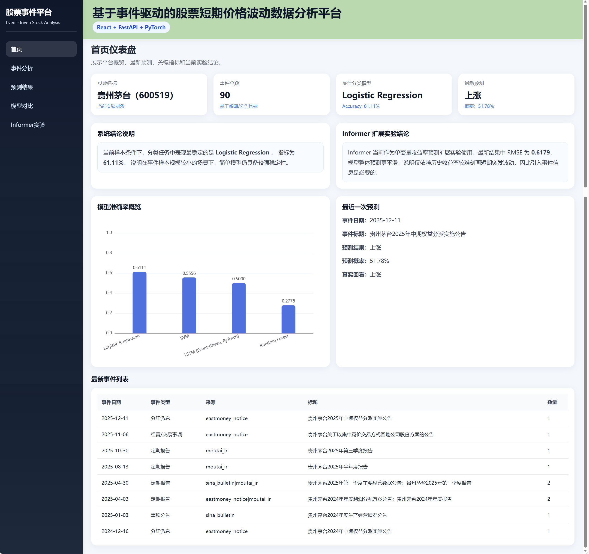

# 系统运行截图说明

## 1. 文档说明

本文档用于说明“基于事件驱动的股票短期价格波动数据分析平台”的主要页面功能、运行效果与系统特点，可作为毕业论文中“系统实现”“系统运行结果展示”或“系统界面说明”部分的配套材料。

本系统以前端 React + Vite、后端 FastAPI 为基础，结合事件驱动 LSTM 真实预测与 Informer 扩展实验，已经实现从数据处理、模型训练、结果保存、后端服务到前端可视化展示的完整闭环。系统不仅能够展示实验结果，还具备真实模型推理、真实值回看、事件窗口分析和扩展实验运行等能力。

---

## 2. 系统整体说明

本平台围绕“股票短期价格波动预测”任务展开，以贵州茅台（600519）为实验对象，结合股票历史行情与公告/新闻事件信息，构建了一个集以下功能于一体的数据分析平台：

1. 股票数据读取与缓存  
2. 公告/新闻事件构建  
3. 事件日期与交易日自动对齐  
4. 事件窗口生成与可视化分析  
5. 无信息泄露特征工程  
6. Baseline 模型训练与结果对比  
7. 事件驱动 LSTM 模型训练与真实推理  
8. Informer 单变量收益率预测扩展实验  
9. FastAPI 后端接口封装  
10. React 前端可视化展示  

从系统定位上看，本平台并不只是单纯展示模型结果，而是实现了“数据处理—模型训练—模型推理—结果展示—实验扩展”的完整流程，能够较好体现毕业设计的工程实现能力与实验研究能力。

---

## 3. 首页仪表盘

### 3.1 页面功能

首页仪表盘用于展示系统总体运行状态，是平台的总览页面。该页面主要承担“集中展示核心指标、实验结论和近期结果”的作用，方便用户在进入系统后快速了解当前系统状态与实验概况。

### 3.2 页面主要内容

首页主要由以下几个部分组成：

1. **顶部平台标题区域**  
   展示系统名称“基于事件驱动的股票短期价格波动数据分析平台”以及技术栈说明“React + FastAPI + PyTorch”。

2. **左侧导航栏**  
   提供首页、事件分析、预测结果、模型对比、Informer 实验等模块入口，用于系统页面切换。

3. **关键指标卡片区域**  
   展示当前实验股票、事件总数、最佳分类模型、最新预测结果等核心信息。

4. **系统结论说明区域**  
   总结当前实验结果，例如当前最优分类模型、Informer 扩展实验的主要结论等。

5. **模型表现概览图**  
   展示分类模型在 Accuracy 指标下的对比结果，用于快速观察模型优劣。

6. **最新事件列表区域**  
   展示近期事件数据，帮助用户快速掌握最新事件信息。

### 3.3 页面实现意义

首页仪表盘用于将系统中最重要的信息集中呈现。通过卡片、图表与说明文字相结合的方式，该页面不仅实现了实验结果的可视化展示，还强化了系统整体结论的表达能力，使平台更像一个完整的数据分析系统，而不仅是若干页面的简单拼接。

### 3.4 论文可用说明文字

首页仪表盘用于集中展示平台总体运行情况与实验概要。页面顶部展示平台名称及技术实现方式，中部通过指标卡片展示当前实验股票、事件总数、最优分类模型与最新预测结果，并以柱状图方式呈现分类模型在 Accuracy 指标下的表现。页面同时提供系统结论说明，帮助用户快速理解当前模型结果及扩展实验的主要结论，从而增强系统展示的完整性与可解释性。

### 3.5 截图插入位置

> 在此处插入首页仪表盘截图。  
> 建议图片命名：`dashboard.png`

```md
